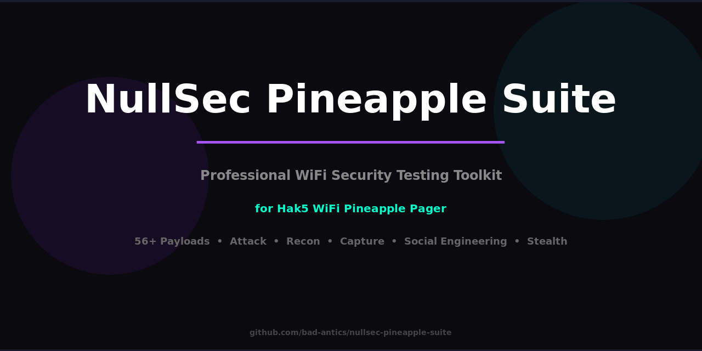

<p align="center">
  
</p>

<h1 align="center">🍍 NullSec Pineapple Suite</h1>

<p align="center">
  <b>The Largest WiFi Pineapple Pager Payload Collection</b><br>
  <i>96 payloads across 13 categories — more than any other third-party suite</i>
</p>

<p align="center">
  <a href="https://github.com/bad-antics/nullsec-pineapple-suite/stargazers"></a>
  <a href="https://github.com/bad-antics/nullsec-pineapple-suite/network/members"></a>
  
  
  
  <a href="LICENSE"></a>
</p>

<p align="center">
  <a href="#-quick-start">Quick Start</a> •
  <a href="#-payload-catalog">Payload Catalog</a> •
  <a href="#-categories">Categories</a> •
  <a href="#-installation">Installation</a> •
  <a href="#-contributing">Contributing</a>
</p>

---

## 🎯 Overview

**NullSec Pineapple Suite** is the most comprehensive third-party payload collection for the [Hak5 WiFi Pineapple Pager](https://shop.hak5.org/products/wifi-pineapple). With **96 professional payloads** spanning 13 categories, it covers every aspect of WiFi security testing — from reconnaissance and interception to exfiltration and stealth operations.

### Why NullSec Suite?

| Feature | NullSec Suite | Hak5 Official | Others |
|---------|:------------:|:--------------:|:------:|
| Total Payloads | **96** | 155 | 5-20 |
| Categories | **13** | ~10 | 2-4 |
| Attack Payloads | **16** | ~8 | 1-3 |
| Recon Payloads | **17** | ~9 | 1-5 |
| Stealth Suite | **9** | 0 | 0 |
| Games | **3** | 8 | 0 |
| One-Click Install | ✅ | ✅ | ❌ |
| Active Development | ✅ | ✅ | ❌ |

---

## ⚡ Quick Start

```bash
# Clone & install (one command)
git clone https://github.com/bad-antics/nullsec-pineapple-suite && cd nullsec-pineapple-suite && ./install.sh

# Or via SSH directly to Pineapple
ssh root@172.16.52.1 "cd /tmp && git clone https://github.com/bad-antics/nullsec-pineapple-suite && cd nullsec-pineapple-suite && ./install.sh"
```

After install: **Dashboard** → **Payloads** → **User** → **nullsec** → Pick any payload and run!

---

## 📦 Categories

### 🚨 Alerts (7 payloads)
Real-time monitoring and alerting for security events.

| Payload | Description |
|---------|-------------|
| **DeauthAlert** | Monitors for deauthentication frames and alerts on attacks |
| **HandshakeAlert** | Watches for WPA handshake captures in real-time |
| **ClientAlert** | Alerts when new clients connect to your AP |
| **RogueAPAlert** | Detects evil twin and rogue access points |
| **IntrusionAlert** | Lightweight IDS — port scans, ARP spoofing, SYN floods |
| **BandwidthAlert** | Monitors bandwidth usage with configurable thresholds |
| **GeoFenceAlert** | GPS-based geofence monitoring for device tracking |

### ⚔️ Attack (16 payloads)
Offensive WiFi security testing tools.

| Payload | Description |
|---------|-------------|
| **AuthFlood** | Authentication flood using aireplay-ng |
| **Banshee** | Multi-vector WiFi disruption |
| **CaptivePortal** | Custom captive portal for credential harvesting |
| **ChannelJammer** | Targeted channel jamming |
| **DeauthStorm** | Mass deauthentication with targeting |
| **DNSHijack** | DNS hijacking for traffic redirection |
| **EvilTwin** | Evil twin AP with automatic client migration |
| **FloodGate** | Combined deauth + beacon + auth flood assault |
| **HotspotHijack** | Hijack existing hotspot connections |
| **KarmaAttack** | Respond to all probe requests |
| **MassDeauth** | Mass deauthentication of all nearby clients |
| **ProbeAttack** | Exploit probe requests to lure clients |
| **Siren** | Audio-visual attack alerts |
| **TargetedDeauth** | Precision deauth of specific clients |
| **WPSBruteforce** | WPS PIN brute force with Pixie Dust |
| **WifiJammer** | Broad-spectrum WiFi jamming |

### 🤖 Automation (4 payloads)
Set-and-forget automated attack chains.

| Payload | Description |
|---------|-------------|
| **AutoPwn** | Fully automated: scan → identify → exploit chain |
| **Reaper** | Automated client harvesting and processing |
| **TimeBomb** | Schedule attacks for delayed execution |
| **ZeroClick** | Zero-interaction automated exploitation |

### 🔐 Capture (6 payloads)
Credential and handshake capture tools.

| Payload | Description |
|---------|-------------|
| **CredSniffer** | Real-time credential sniffing from traffic |
| **HandshakeHunter** | Automated WPA/WPA2 handshake capture |
| **PMKIDCapture** | PMKID-based WPA capture (clientless) |
| **PacketReplay** | Capture and replay network packets |
| **USBCredStealer** | USB-based credential extraction |
| **WPACracker** | On-device WPA handshake cracking |

### 📤 Exfiltration (4 payloads)
Data extraction and loot management.

| Payload | Description |
|---------|-------------|
| **DataVacuum** | Extract URLs, cookies, credentials from traffic |
| **CloudExfil** | Upload loot to cloud storage (Dropbox, webhooks) |
| **LootSync** | Sync all captured loot to USB storage |
| **DNSExfil** | Covert data exfiltration via DNS tunneling |

### 🎮 Games (3 payloads)
Entertainment for downtime during engagements.

| Payload | Description |
|---------|-------------|
| **PagerPong** | Text-based Pong game on Pager display |
| **WarGames** | WOPR-style hacking simulation (4 game modes) |
| **NumberCracker** | Number guessing game with hacking theme |

### 🕵️ Interception (5 payloads)
Man-in-the-middle and traffic interception.

| Payload | Description |
|---------|-------------|
| **MITMProxy** | Transparent HTTP/HTTPS proxy with logging |
| **ARPSpoof** | ARP cache poisoning for MITM attacks |
| **SSLStrip** | HTTPS downgrade attacks |
| **DNSSiphon** | DNS query interception and browsing pattern analysis |
| **PacketSniffer** | Protocol-aware packet capture (HTTP/FTP/SMTP/DNS) |

### 🎪 Pranks (5 payloads)
Fun and harmless WiFi pranks.

| Payload | Description |
|---------|-------------|
| **BeaconSpam** | Flood area with fake SSIDs |
| **NetParasite** | Inject content into HTTP traffic |
| **RickRoll** | Redirect all HTTP to Rick Astley |
| **SSIDPranks** | Creative SSID message broadcasting |
| **WiFiConfuser** | Generate confusing network environments |

### 🔍 Recon (17 payloads)
The largest recon suite available for Pineapple Pager.

| Payload | Description |
|---------|-------------|
| **BluetoothScanner** | Classic BT + BLE device discovery |
| **ClientTracker** | Track client devices across networks |
| **DeviceFingerprint** | OS and device fingerprinting via WiFi |
| **DroneHunter** | Detect and track nearby drones |
| **HiddenNetFinder** | Discover hidden/cloaked SSIDs |
| **IoTScanner** | Identify IoT devices on networks |
| **NetworkMapper** | Complete network topology mapping |
| **PasspointScanner** | Hotspot 2.0 / Passpoint network discovery |
| **ProbeHunter** | Capture and analyze probe requests |
| **QuickScan** | Fast area WiFi assessment |
| **SignalTracker** | Track signal strength over time |
| **SocialMapper** | Map social connections via device relationships |
| **SpectrumAnalyzer** | Channel utilization and interference analysis |
| **StealthRecon** | Low-profile reconnaissance |
| **VendorHunt** | Identify devices by OUI/vendor lookup |
| **WPSScanner** | WPS-enabled network discovery |
| **WiFiAudit** | Comprehensive WiFi security audit |

### 🔗 Remote Access (4 payloads)
Remote control and persistent access.

| Payload | Description |
|---------|-------------|
| **TunnelRat** | Reverse SSH tunnel with auto-reconnect |
| **C2Beacon** | HTTP-based command & control beacon |
| **PagerLink** | Remote Pager UI access via SSH tunnel |
| **VPNConnect** | WireGuard/OpenVPN connectivity |

### 🎭 Social Engineering (5 payloads)
Social engineering and phishing tools.

| Payload | Description |
|---------|-------------|
| **CoffeeShopAttack** | Coffee shop credential harvesting scenario |
| **FakeUpdate** | Fake software update portal |
| **NullSecDeface** | Custom web page injection |
| **NullSecPortal** | NullSec-branded captive portal |
| **PortalMaster** | Advanced portal template management |

### 👻 Stealth (9 payloads)
The most comprehensive stealth suite for any Pineapple payload collection.

| Payload | Description |
|---------|-------------|
| **GhostNetwork** | Invisible C2 channel using null SSID |
| **Honeypot** | Decoy AP with attacker logging |
| **LogWiper** | Secure log wiping (3-pass overwrite) |
| **Mimic** | Clone and impersonate legitimate APs |
| **Phantom** | Appear/disappear on command |
| **Poltergeist** | Intermittent interference causing confusion |
| **Specter** | Long-duration low-profile surveillance |
| **TrafficMask** | Disguise Pineapple as normal device (7 profiles) |
| **Wraith** | Channel-hopping stealth operations |

### 🔧 Utility (11 payloads)
System management and configuration tools.

| Payload | Description |
|---------|-------------|
| **BootOptimizer** | Optimize Pineapple boot performance |
| **FirewallManager** | Manage iptables rules from Pager UI |
| **MACChanger** | Change MAC addresses (random/specific/vendor) |
| **NullSecConfig** | NullSec Suite configuration management |
| **PackageManager** | Manage opkg packages from Pager |
| **RangeExtender** | Extend WiFi range with repeater mode |
| **ScheduleTask** | Cron-based payload scheduling |
| **SpeedTest** | Internet connection speed testing |
| **SystemInfo** | Comprehensive system information display |
| **WaveRider** | Channel-hopping target pursuit |
| **WordlistManager** | Wordlist management for cracking |

---

## 🚀 Installation

### Option 1: One-Click Install
```bash
git clone https://github.com/bad-antics/nullsec-pineapple-suite
cd nullsec-pineapple-suite
./install.sh
```

### Option 2: Direct to Pineapple
```bash
ssh root@172.16.52.1
git clone https://github.com/bad-antics/nullsec-pineapple-suite /tmp/ns
cp -r /tmp/ns/payloads/*/* /root/payloads/user/nullsec/
cp /tmp/ns/lib/* /root/payloads/library/
```

### Option 3: USB Sideload
```bash
# On your computer
git clone https://github.com/bad-antics/nullsec-pineapple-suite
# Copy to USB drive, plug into Pineapple, then:
cp -r /mnt/usb/nullsec-pineapple-suite/payloads/*/* /root/payloads/user/nullsec/
```

### Requirements
- WiFi Pineapple Pager (firmware 1.0+)
- External WiFi adapter (for monitor mode payloads)
- `aircrack-ng` suite (pre-installed on Pager)
- Optional: `nmap`, `hcxdumptool`, `reaver` (install via PackageManager payload)

---

## 📖 Usage

### Standard Mode
**Dashboard** → **Payloads** → **User** → **nullsec** → Select & Run

### Targeted Mode (Recommended)
1. Run a **Recon** payload first (QuickScan, WiFiAudit)
2. Select a target from scan results  
3. Run **Attack/Capture** payloads — target info auto-injected!

### Workflow Examples

**Handshake Capture:**
```
QuickScan → HandshakeHunter → WPACracker → CloudExfil
```

**Full Engagement:**
```
WiFiAudit → EvilTwin → CredSniffer → DataVacuum → LootSync
```

**Stealth Recon:**
```
TrafficMask → StealthRecon → HiddenNetFinder → PasspointScanner
```

---

## 📁 Project Structure

```
nullsec-pineapple-suite/
├── payloads/
│   ├── alerts/        # 🚨 7 monitoring & alerting payloads
│   ├── attack/        # ⚔️ 16 offensive payloads
│   ├── automation/    # 🤖 4 automated attack chains
│   ├── capture/       # 🔐 6 credential/handshake capture
│   ├── exfiltration/  # 📤 4 data extraction tools
│   ├── games/         # 🎮 3 entertainment payloads
│   ├── interception/  # 🕵️ 5 MITM/traffic interception
│   ├── pranks/        # 🎪 5 harmless WiFi pranks
│   ├── recon/         # 🔍 17 reconnaissance payloads
│   ├── remote/        # 🔗 4 remote access tools
│   ├── social/        # 🎭 5 social engineering
│   ├── stealth/       # 👻 9 stealth operations
│   └── utility/       # 🔧 11 system management tools
├── lib/               # Core libraries & helpers
├── theme/             # NullSec Pager theme
├── install.sh         # One-click installer
├── LICENSE
└── README.md
```

---

## 🔗 Related Projects

| Project | Description |
|---------|-------------|
| [nullsec-linux](https://github.com/bad-antics/nullsec-linux) | Security-focused Linux distro with 135+ tools |
| [nullsec-flipper-suite](https://github.com/bad-antics/nullsec-flipper-suite) | Flipper Zero payloads, animations & tools |
| [nullsec-exploit](https://github.com/bad-antics/nullsec-exploit) | Exploit development framework |
| [marshall](https://github.com/bad-antics/marshall) | NullSec Privacy Browser |

---

## 🤝 Contributing

Contributions welcome! See [CONTRIBUTING.md](CONTRIBUTING.md) for guidelines.

1. Fork the repo
2. Create your payload in the appropriate category
3. Follow the [payload template](docs/PAYLOAD_TEMPLATE.md)
4. Submit a Pull Request

---

## ⚠️ Legal Disclaimer

**For authorized penetration testing and educational purposes ONLY.**

- ❌ Do NOT use without explicit written permission
- ❌ Unauthorized network access is ILLEGAL
- ✅ Get written authorization before any testing
- ✅ Use only in controlled lab environments or with permission
- ✅ You are solely responsible for your actions

The authors assume no liability for misuse of these tools.

---

## 📊 Stats

| Metric | Value |
|--------|-------|
| Total Payloads | **96** |
| Categories | **13** |
| Largest Category | Recon (17) |
| Average Payload Size | ~150 lines |
| Platform | WiFi Pineapple Pager |
| Last Updated | February 2026 |

---

## 📄 License

MIT License — See [LICENSE](LICENSE) for details.

---

<p align="center">
  <b>NullSec</b> — <i>96 ways to own the airwaves</i> 🍍<br>
  <a href="https://github.com/bad-antics">github.com/bad-antics</a>
</p>
