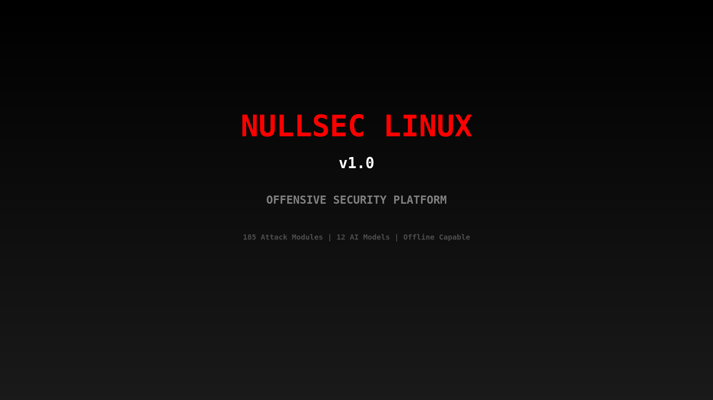

<p align="center">
  
</p>

<h1 align="center">🍍 NullSec Pineapple Suite</h1>

<p align="center">
  <b>The Ultimate WiFi Pineapple Pager Payload Collection</b>
</p>

<p align="center">
  
  
  
  
</p>

---

## 🎯 Overview

NullSec Pineapple Suite is a comprehensive collection of **58+ professional payloads** for the Hak5 WiFi Pineapple Pager. From reconnaissance to exploitation, this suite covers every aspect of WiFi security testing.

## ✨ Features

- 🔥 **58+ Battle-Tested Payloads**
- 🎯 **Targeted Payload Support** - Auto-inject target parameters
- 🎨 **Custom NullSec Theme**
- 📚 **Core Libraries**
- 🔄 **One-Click Install**

---

## 📦 Payload Categories

| Category | Count | Description |
|----------|-------|-------------|
| ⚔️ **Attack** | 12 | Deauth, jamming, evil twin, DNS hijack |
| 🔍 **Recon** | 12 | Scanning, fingerprinting, tracking |
| 🔐 **Capture** | 6 | Handshakes, PMKID, credentials |
| 🎭 **Social** | 5 | Captive portals, phishing |
| 👻 **Stealth** | 7 | Ghost networks, honeypots |
| 🤖 **Automation** | 4 | Auto-pwn, scheduled attacks |
| 🎪 **Pranks** | 5 | Beacon spam, RickRoll |
| 🔧 **Utility** | 7 | Config, optimization |

### Highlight Payloads

| Payload | Description |
|---------|-------------|
| **ZeroClick** | Fully automated: scan → identify → exploit |
| **GhostNetwork** | Invisible C2 with null SSID |
| **TimeBomb** | Schedule attacks for later |
| **SocialMapper** | Map device social connections |
| **Honeypot** | Decoy AP with attacker logging |
| **WaveRider** | Channel-hopping target pursuit |

---

## 🚀 Installation

### One-Click Install
```bash
git clone https://github.com/bad-antics/nullsec-pineapple-suite
cd nullsec-pineapple-suite
./install.sh
```

### Manual Install
```bash
ssh root@172.16.52.1
git clone https://github.com/bad-antics/nullsec-pineapple-suite /tmp/ns
cp -r /tmp/ns/payloads/*/* /root/payloads/user/nullsec/
cp /tmp/ns/lib/* /root/payloads/library/
```

---

## 📖 Usage

### Standard Payloads
**Dashboard** → **Payloads** → **User** → **nullsec** → Select & Run

### Targeted Payloads (Recommended)
1. **Recon** → Scan → Select AP/Client
2. **Payloads** → **NullSec-{Name}**
3. Target info auto-injected!

---

## 📁 Structure

```
nullsec-pineapple-suite/
├── payloads/
│   ├── attack/       # Deauth, jamming, evil twin
│   ├── recon/        # Scanning, tracking
│   ├── capture/      # Handshakes, creds
│   ├── social/       # Portals, phishing
│   ├── stealth/      # Ghost, honeypot
│   ├── automation/   # Auto-pwn, scheduled
│   ├── pranks/       # Fun stuff
│   └── utility/      # Config, tools
├── lib/              # Core libraries
├── theme/            # NullSec theme
└── install.sh
```

---

## ⚠️ Legal Disclaimer

**For authorized penetration testing ONLY.**

- ❌ Do NOT use without permission
- ❌ Unauthorized access is ILLEGAL
- ✅ Get written authorization first
- ✅ Use in controlled environments

---

## 👤 Author

**bad-antics** - [GitHub](https://github.com/bad-antics)

## 📄 License

MIT License - See [LICENSE](LICENSE)

---

<p align="center">
  <b>NullSec</b> - <i>Hacking the planet, one pineapple at a time</i> 🍍
</p>
